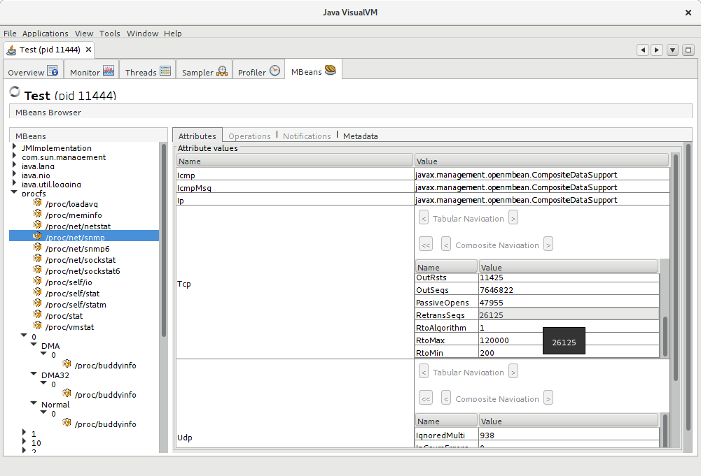

java-procfs-mbeans-agent
========================

Java agent to make /proc metrics available as MXBeans, which is mainly intended for use with [java-influxdb-metrics-agent](https://github.com/eiiches/java-influxdb-metrics-agent) or [java-prometheus-metrics-agent](https://github.com/eiiches/java-prometheus-metrics-agent) to send /proc metrics to InfluxDB or Prometheus.

**WARNING** (2017-11-27) I just started this project and should not be considered production-ready yet. Also, I'm developing this on linux 4.13 so might not work well on older kernels for now.

Installation
------------

#### Building from source

```sh
git clone https://github.com/eiiches/java-procfs-mbeans-agent.git
cd java-procfs-mbeans-agent
mvn clean package
```

Then, copy `target/java-procfs-mbeans-agent-{version}.jar` to your desired location.

#### Downloading from Maven Central

```sh
curl -O 'http://central.maven.org/maven2/net/thisptr/java-procfs-mbeans-agent/0.0.2/java-procfs-mbeans-agent-0.0.2.jar'
```

Usage
-----

```sh
java -javaagent:/path/to/java-procfs-mbeans-agent-$VERSION.jar [-javaagent:/path/to/java-influxdb-metrics-agent-0.0.2.jar=/procfs/{namekeys=path},...] ...
```



Current Status
--------------

| path                         | status |
|------------------------------|--------|
| /proc/buddyinfo              | DONE   |
| /proc/cpuinfo                |        |
| /proc/diskstats              | DONE   |
| /proc/interrupts             |        |
| /proc/loadavg                | DONE   |
| /proc/meminfo                | DONE   |
| /proc/net/dev                |        |
| /proc/net/netstat            | DONE   |
| /proc/net/snmp6              | DONE   |
| /proc/net/snmp               | DONE   |
| /proc/net/sockstat6          | DONE   |
| /proc/net/sockstat           | DONE   |
| /proc/net/stat/arp_cache     |        |
| /proc/net/stat/ndisc_cache   |        |
| /proc/net/stat/nf_conntrack  |        |
| /proc/net/stat/rt_cache      |        |
| /proc/pagetypeinfo           |        |
| /proc/schedstat              |        |
| /proc/self/io                | DONE   |
| /proc/self/stat              | DONE   |
| /proc/self/statm             | DONE   |
| /proc/slabinfo               |        |
| /proc/softirqs               | DONE   |
| /proc/stat                   | DONE   |
| /proc/swaps                  |        |
| /proc/sys/fs/aio-nr          |        |
| /proc/sys/fs/dentry-state    |        |
| /proc/sys/fs/file-nr         |        |
| /proc/sys/fs/inode-nr        |        |
| /proc/sys/fs/inode-state     |        |
| /proc/sys/kernel/pty/nr      |        |
| /proc/sys/kernel/random/entropy_avail |        |
| /proc/uptime                 |        |
| /proc/vmstat                 | DONE   |
| /proc/zoneinfo               |        |

License
-------

[The Apache License, Version 2.0](LICENSE)
